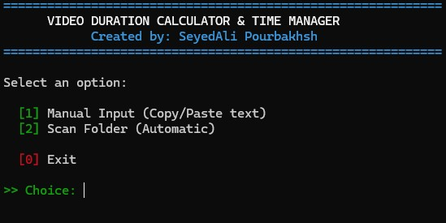
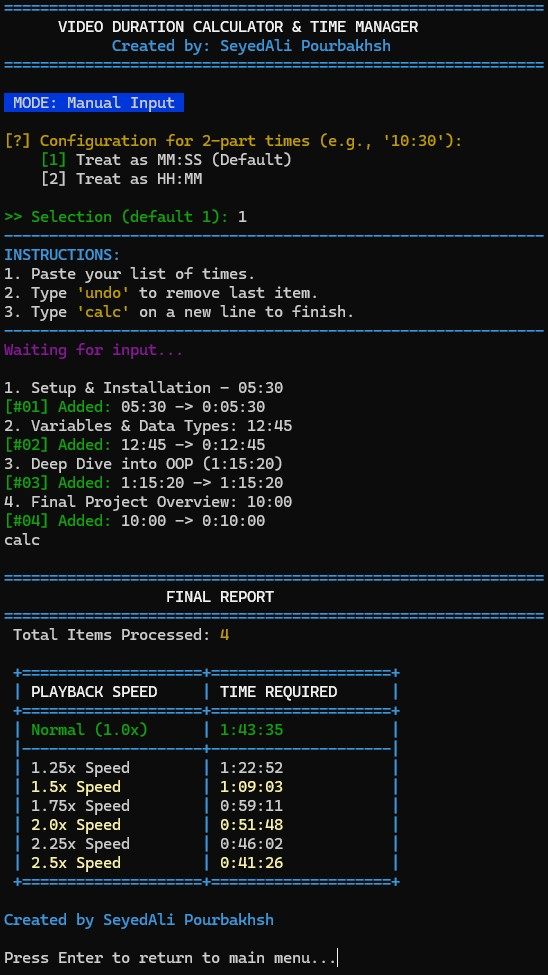

<div align="center">

# 🎬 Video Duration Calculator & Time Manager

### A Simple tool for students, researchers, and video editors.

[](https://www.python.org/)
[](https://opensource.org/licenses/MIT)
[](https://github.com/SAli-Pourbakhsh/Video-Duration-Calculator/graphs/commit-activity)

</div>

---

## 📖 Overview
**Video Duration Calculator** is a robust CLI-based tool designed to calculate the total duration of video files. Whether you have a messy list of timestamps copied from a website or a folder full of video tutorials, this tool sums them up instantly.

It supports **Smart Parsing**, **Recursive Directory Scanning**, and provides **Playback Speed Analysis**.

---

## ✨ Key Features

### ✅ **Smart Parsing:** Automatically detects formats like `MM:SS` or `HH:MM:SS`.
### ✅ **Directory Scan:** Recursively scans folders to find all video files and calculate total duration.
### ✅ **Undo Functionality:** Made a mistake? Easily undo the last entry in manual mode.
### ✅ **Playback Speed Analysis:** Shows how long it takes to watch videos at **1.25x**, **1.5x**, **2.0x** speeds.
### ✅ **Robust Input:** Handles copy-pasting from messy text sources seamlessly.

---

## 📸 App Preview

<div align="center">
  
  
  <br>
  <em>Smart parsing in action with playback speed analysis table.</em>
</div>

---

## 🚀 How to Run (3 Ways)

Choose the method that fits your operating system and needs:

### 1️⃣ Windows: No Installation (Easiest)
*Best for users who just want to use the tool without installing Python.*
1. Go to the [**Releases Page**](https://github.com/SAli-Pourbakhsh/Video-Duration-Calculator/releases).
2. Download the latest `VideoCalculator.exe`.
3. Double-click to run anywhere!

### 2️⃣ Windows: Auto-Launcher (Source Code)
*Best for developers on Windows who want to run from source easily.*
1. Clone or download this repository.
2. Double-click on `Video_Calculator.bat`.
3. The script will automatically install dependencies and launch the tool.

### 3️⃣ Linux / macOS / Manual Execution
*Best for non-Windows users or those who prefer using the terminal.*

1.  **Clone the repository**:
    ```bash
    git clone https://github.com/SAli-Pourbakhsh/Video-Duration-Calculator.git
    ```
2.  **Install dependencies**:
    ```bash
    pip install -r requirements.txt
    ```
3.  **Run the script**:
    ```bash
    python Video_Calculator.py
    ```

---

## 🛠 Technologies Used
* **Python 3**: Core logic
* **MoviePy**: For accurate video metadata extraction
* **Colorama**: For a beautiful, colored command-line interface
* **PyInstaller**: For building the standalone executable

## 👤 Author
**SeyedAli Pourbakhsh**
* Computer Engineering Student at Qom University of Technology

---
*Created with ❤️ for better time management.*


